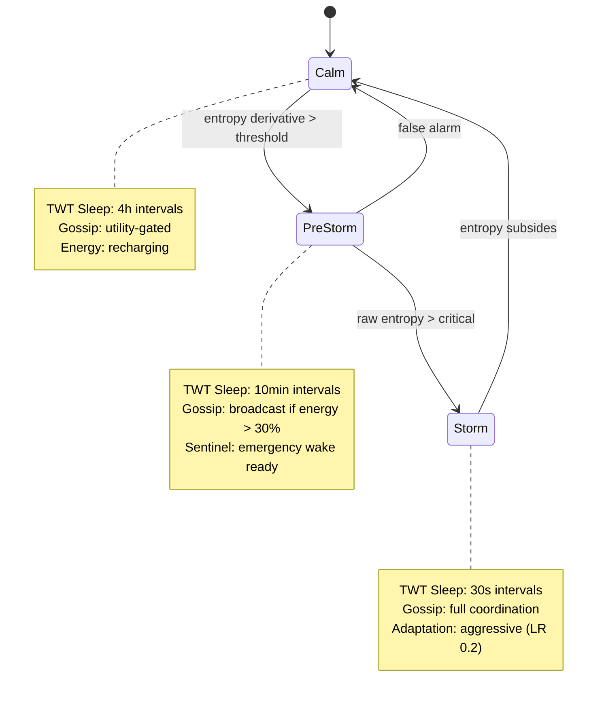

# QRES &mdash; RaaS: Resource-Aware Agentic Swarm

[](https://github.com/CavinKrenik/QRES_RaaS/releases)
[](https://doi.org/10.5281/zenodo.18193905)
[](https://doi.org/10.5281/zenodo.18474976)
[](https://docs.rust-embedded.org/book/intro/no-std.html)
[](LICENSE-MIT)
[](https://www.rust-lang.org/)

> **A decentralized operating system for autonomous agents on physical hardware with finite energy, unreliable links, and adversarial peers.**

RaaS (Resource-Aware Agentic Swarm) enforces three architectural pillars for survival: **Energy-Bounded Agency** (every operation is gated by energy accounting), **Verifiable Integrity** (cryptographic proofs without central trust), and **Autonomous Triage** (self-organizing regime switching). The reference implementation (QRES) uses deterministic rematerialization and Q16.16 fixed-point consensus to achieve 99% bandwidth reduction vs federated learning while tolerating 30% Byzantine attackers.

**Architectural Scope:**
Read **[SCOPE.md](./docs/SCOPE.md)** before deployment or evaluation. QRES is intentionally narrow.

---

## The Three Pillars of a Resource-Aware Swarm

See **[RAAS_MANIFEST.md](./RAAS_MANIFEST.md)** for the full technical thesis.



| Pillar | Mechanism | Result |
|--------|-----------|--------|
| **Energy-Bounded Agency** | SNN-inspired energy pools, TWT radio scheduling, regime-driven silence | 21.9x energy advantage over ANN swarms; >80% bandwidth savings during Calm |
| **Verifiable Integrity** | Curve25519 ZK proofs, pairwise secure aggregation, reputation tracking | Sybil attackers banned within 4 rounds; drift < 5% under active attack |
| **Autonomous Triage** | 3-regime state machine (Calm/PreStorm/Storm), predictive entropy detection | 4-tick early warning; nodes self-organize sleep schedules by reputation |

---

## Verified Performance (v19.0.1)


| Metric | Result | Context |
|--------|--------|---------|
| **Convergence** | <30 epochs to consensus | Verified on 100-node swarms with noise injection |
| **Bandwidth** | 99% reduction vs federated learning | 8 KB/day vs 2.3 GB/day for traditional FL |
| **Scalability** | 10,000 nodes (100% success) | Azure Standard_D2s, verified Jan 2026 |
| **Compression** | 4.98x-31.8x (dataset-dependent) | SmoothSine 31.8x, Wafer 4.98x, ECG5000 4.98x |
| **Memory** | < 1 KB per node overhead | `no_std` + `alloc`, O(1) per node |
| **Byzantine Tolerance** | Drift < 5% at 30% coordinated bias | Coordinate-wise trimmed mean |
| **Energy** | 21.9x advantage (SNN vs ANN) | Verified in simulation collapse test |
| **TWT Sleep Savings** | 82% reduction in radio energy | MockRadio verified over 24h simulated period |

---

## Architecture: The RaaS Reference Implementation

```
QRES_RaaS/
├── crates/
│   ├── qres_core/           # no_std deterministic core (Body + Hippocampus)
│   │   ├── adaptive/        # Regime detection, silence protocol
│   │   ├── cortex/          # SwarmNeuron trait, LinearNeuron, gene storage
│   │   ├── consensus/       # Byzantine-tolerant aggregation (Krum, trimmed mean)
│   │   ├── power/           # TWT scheduler, reputation-weighted sleep
│   │   ├── packet/          # MTU fragmentation, GhostUpdate gossip
│   │   └── ...              # ZK proofs, secure aggregation, privacy, reputation
│   ├── qres_daemon/         # P2P edge daemon (libp2p gossipsub + REST API)
│   └── qres_wasm/           # WebAssembly bindings
├── tools/
│   └── swarm_sim/           # Bevy 3D simulator (150-node emergent behavior)
├── evaluation/              # Benchmark harness and cloud results
├── docs/                    # Specifications, theory, guides, ADRs
│   └── power/               # TWT integration docs
└── RAAS_MANIFEST.md         # Resource-Aware Swarm thesis
```

### The Body: `qres_core`

A `no_std` Rust library. All consensus math uses Q16.16 fixed-point (`I16F16`) for bit-perfect determinism across x86, ARM, RISC-V, and WASM. Key subsystems:

- **Regime Detection** &mdash; 3-point moving-average entropy with predictive PreStorm trigger
- **Strategic Silence** &mdash; Utility-gated gossip: `broadcast = (entropy * reputation) > (cost * bias)`
- **TWT Power Scheduling** &mdash; Reputation-weighted sleep intervals with gossip batching
- **Byzantine Aggregation** &mdash; Coordinate-wise trimmed mean, BFP-16 block floating point
- **Zero-Knowledge Integrity** &mdash; Non-interactive Sigma protocol over Edwards curves
- **Secure Aggregation** &mdash; Pairwise x25519 masking with wrapping cancellation
- **Energy Accounting** &mdash; Deterministic energy pools with hardware-calibrated profiles

### The Mind: `swarm_sim`

Bevy-based 3D simulator demonstrating emergent swarm behavior: gene gossip, noise-zone storms, mutation cascades, and Lamarckian evolution. Up to 100 nodes in 10x10 grid with force-directed physics, HDR bloom, and real-time HUD metrics.

### The Hippocampus: Persistent Memory

Trait-based gene storage (`GeneStorage`) enabling learned strategies to survive reboots. Disk, cloud, or IPFS backends. Evolved genes auto-load on spawn.

---

## Power Management: TWT Integration

QRES coordinates Wi-Fi 6 Target Wake Time scheduling with regime-aware silence:

| Regime | TWT Interval | Sleep Power | Active Power |
|--------|-------------|-------------|-------------|
| Calm | 4 hours (rep-weighted) | 35 mW | 230 mW |
| PreStorm | 10 minutes (rep-weighted) | 35 mW | 230 mW |
| Storm | 30 seconds (rep-weighted) | 35 mW | 230 mW |

Reputation-weighted intervals stagger wake times across the swarm, preventing blind spots. High-reputation nodes sleep longer (proven reliable); low-reputation nodes wake 5x more often (must contribute). Currently in simulation mode via `MockRadio`; hardware integration targets ESP32-C6 native TWT.

See: [docs/power/TWT_INTEGRATION.md](docs/power/TWT_INTEGRATION.md)

---

## Hardware Compatibility

| Tier | Platform | TWT Support | Status |
|------|----------|-------------|--------|
| **Tier 1** | ESP32-C6 | Native Wi-Fi 6 / TWT | Target (no_std core ready) |
| **Tier 2** | Raspberry Pi Zero 2 W | Simulated TWT / Linux edge | Calibration-ready (energy profiles defined) |
| **Tier 3** | RISC-V Custom Silicon | Theoretical | no_std core compiles; awaiting hardware |
| **Tier 4** | x86_64 / WASM | Simulation only | Full test suite, cloud benchmarks verified |

All tiers share the same `qres_core` binary. Hardware-specific behavior is isolated behind `EnergyProfile` constants and the `MockRadio`/real-radio abstraction.

---

## Getting Started

### Prerequisites

- Rust 1.70+ (install via [rustup](https://rustup.rs/))
- Cargo (included with Rust)

### Build & Test

```bash
# Core crate (no_std)
cargo build -p qres_core --no-default-features --release

# Full test suite (81 tests passing: unit + integration + v19 verification)
cargo test -p qres_core --features std

# TWT scheduler tests specifically
cargo test -p qres_core --features std -- power::

# Daemon (P2P edge node)
cargo build -p qres_daemon --release

# 3D Simulator
cargo run -p swarm_sim --release
```

### Run the Neural Swarm Simulator


```bash
cargo run -p swarm_sim --release
```

| Key | Action |
|-----|--------|
| Left-click + drag | Orbit camera |
| Scroll wheel | Zoom in/out |
| Spacebar | Toggle auto-rotation |
| R | Reset simulation |

---

## Documentation

| Category | Files |
|----------|-------|
| **Specification** | [SPEC.md](docs/SPEC.md), [API_REFERENCE.md](docs/API_REFERENCE.md) |
| **Theory** | [THEORY.md](docs/theory/THEORY.md), [SNN_ENERGY_ANALYSIS.md](docs/theory/SNN_ENERGY_ANALYSIS.md) |
| **Power Management** | [TWT_INTEGRATION.md](docs/power/TWT_INTEGRATION.md) |
| **Implementation** | [P2P_IMPLEMENTATION.md](docs/guides/P2P_IMPLEMENTATION.md), [SECURITY_GUIDE.md](docs/guides/SECURITY_IMPLEMENTATION_GUIDE.md) |
| **Benchmarks** | [BENCHMARKS.md](docs/BENCHMARKS.md), [CLOUD_RESULTS.md](docs/CLOUD_BENCHMARK_RESULTS.md) |
| **Process** | [CONTRIBUTING.md](docs/CONTRIBUTING.md), [SCOPE.md](docs/SCOPE.md), [SECURITY_ROADMAP.md](docs/SECURITY_ROADMAP.md) |
| **RaaS Thesis** | [RAAS_MANIFEST.md](RAAS_MANIFEST.md) |

---

## Contributing

See [CONTRIBUTING.md](docs/CONTRIBUTING.md) for development workflow, code style, and architecture decision records.

---

## License

Dual-licensed under [MIT](LICENSE-MIT) or [Apache-2.0](LICENSE-APACHE), at your option.

---

## Citation

```bibtex
@software{qres2026,
  author = {Krenik, Cavin},
  title = {QRES: Resource-Aware Agentic Swarm},
  url = {https://github.com/CavinKrenik/QRES_RaaS},
  doi = {10.5281/zenodo.18474976},
  year = {2026}
}
```

## Publications

| Paper | DOI |
|-------|-----|
| **Deterministic Rematerialization: Convergent Evolution in Cloud Kernels and Edge Swarms** | [](https://doi.org/10.5281/zenodo.18305656) |
| **RaaS: Resource-Aware Agentic Swarm** | [](https://doi.org/10.5281/zenodo.18474976) |

## Reproducibility & Data

This repository contains the full artifacts, data, and source for the RaaS paper:

- **Full Paper**: [Main.pdf](docs/RaaS_Paper/Main.pdf)
- **Raw Data**: [docs/RaaS_Data](docs/RaaS_Data) (Sensitivity sweeps, regime timelines, energy logs)
- **Source**: [docs/RaaS_Paper](docs/RaaS_Paper) (LaTeX source, figures, tables)

---

**Status**: v19.0.1 "Secure & Safe" - High-Integrity Hardening Complete. Formally verified (TLA+), cryptographically secure (ZK-proofs), energy-aware (TWT scheduling). Ready for edge-case evaluation and hardware-in-the-loop deployment.
