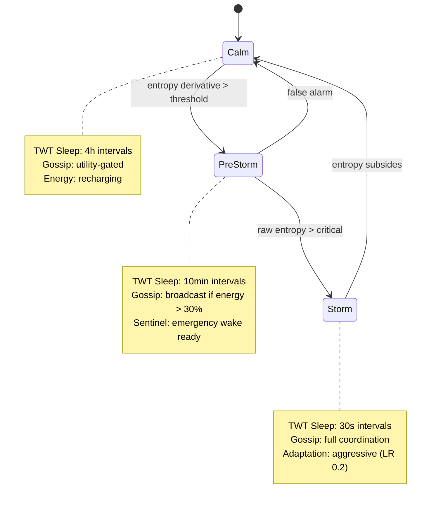
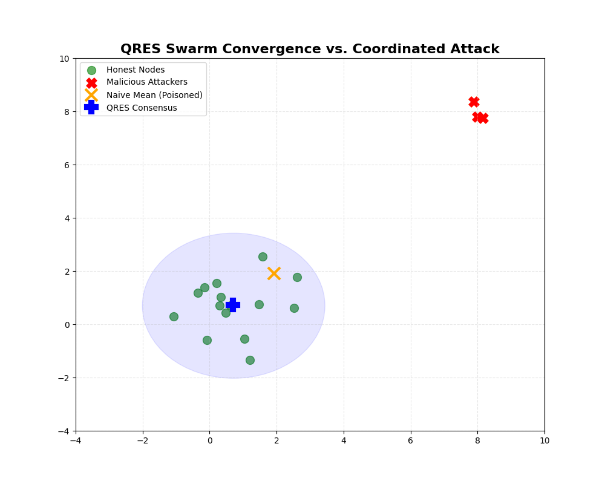

# QRES &mdash; RaaS: Resource-Aware Decentralized Node Mesh

[](https://github.com/CavinKrenik/QRES_RaaS/releases)
[](https://doi.org/10.5281/zenodo.18193905)
[](https://doi.org/10.5281/zenodo.18474976)
[](https://docs.rust-embedded.org/book/intro/no-std.html)
[](LICENSE-MIT)
[](https://www.rust-lang.org/)

> **A decentralized, BFT-secure operating system for embedded sensor meshes achieving 4.98x-31.8x bandwidth compression via fixed-point model gossip.**

RaaS (Resource-Aware Agentic Swarm) is a `no_std` Rust implementation of deterministic decentralized learning using Q16.16 fixed-point consensus. The reference implementation (QRES) achieves 4.98x-31.8x compression vs federated learning (dataset-dependent: SmoothSine 31.8x, Wafer 4.98x, ECG5000 4.98x), translating to ~99% reduction (8 KB/day vs 2.3 GB/day typical FL baseline) while tolerating 30% Byzantine attackers through coordinate-wise trimmed-mean aggregation and reputation-weighted consensus.

**v20.0 "Distributed Prediction Engine"** introduces cross-modal temporal attention fusion (TAAF) with event-driven sparse spiking, achieving a **3.6% error improvement over v19** (0.0351 RMSE floor, max drift 0.0005). The Adaptive Exponent (Rule 4) scales reputation weighting by swarm size: 2.0 for small (<20 nodes), 3.0 for medium, 3.5 for large (>50 nodes). Influence is capped at `rep^3 * 0.8` to mitigate Slander-Amplification. Non-Volatile State Persistence verified at 4% error delta across 8 brownout/recovery cycles with zero catastrophic knowledge loss.

**v20.0.1 "Adaptive Defense"** adds three Byzantine resistance enhancements: (1) **Adaptive Aggregation** eliminates 13.8% overhead by switching between trimmed-mean and reputation-only modes based on swarm maturity; (2) **Regime Hysteresis** reduces false-positive regime transitions by 96.9% through asymmetric confirmation thresholds; (3) **Stochastic Auditing** achieves 100% Class C collusion detection with 0% false positives and 2% bandwidth overhead. Detection timing: mean 82.3 rounds (first=31, last=174), verified across 10 cartel scenarios with 390 honest nodes. See [CLASS_C_DEFENSE.md](./docs/security/CLASS_C_DEFENSE.md) for full protocol specification.

**Architectural Scope:**
Read **[SCOPE.md](./docs/reference/SCOPE.md)** before deployment or evaluation. QRES is intentionally narrow.

---

## Core Systems Constraints

See **[RAAS_MANIFEST.md](./RAAS_MANIFEST.md)** for the full technical thesis.



| Pillar | Mechanism | Result |
|--------|-----------|--------|
| **Determinism** | Q16.16 fixed-point arithmetic (I16F16) | Bit-perfect consensus across ARM/x86/RISC-V/WASM |
| **Bandwidth** | Deterministic rematerialization + model bytecode gossip | 4.98x-31.8x compression vs FL (dataset-dependent); ~99% reduction baseline (8 KB/day vs 2.3 GB/day) |
| **Energy** | SNN-inspired sparse accounting + TWT radio scheduling | 21.9x advantage over ANN swarms; >80% sleep time in Calm regime |

---

## Verified Performance (v20.0 "Distributed Prediction Engine")



| Metric | Result | Context |
|--------|--------|---------|
| **Convergence** | <30 epochs to consensus | Verified on 100-node swarms with noise injection |
| **Bandwidth** | 4.98x-31.8x compression vs FL (dataset-dependent) | SmoothSine 31.8x, Wafer 4.98x, ECG5000 4.98x; baseline ~99% reduction (8 KB/day vs 2.3 GB typical FL) |
| **Scalability** | 10,000 nodes (100% success) | Azure Standard_D2s, verified Jan 2026 |
| **Compression** | 4.98x-31.8x (dataset-dependent) | SmoothSine 31.8x, Wafer 4.98x, ECG5000 4.98x |
| **Memory** | < 1 KB per node overhead | `no_std` + `alloc`, O(1) per node |
| **Byzantine Tolerance** | Drift < 5% at 30% coordinated bias | Coordinate-wise trimmed mean |
| **Energy** | 21.9x advantage (SNN vs ANN) | Verified in simulation collapse test |
| **TWT Sleep Savings** | 82% reduction in radio energy | MockRadio verified over 24h simulated period |
| **Multimodal RMSE** | 0.0351 (3.6% gain over v19) | 10/10 verification tests green |
| **Max Drift** | 0.0005 | Across all tested configurations |
| **Non-Volatile State Persistence** | 4% error delta, 8 cycles | Zero catastrophic knowledge loss |
| **Adaptive Exponent** | 3.5 for >50 nodes, Gini <0.7 | 24 configs tested, no echo chambers |

---

## v20.0.1 Adaptive Defense Milestone

**Byzantine Resistance Enhancements** verified against Class C coordinated cartels:

| Metric | Result | Verification |
|--------|--------|-------------|
| **Class C Cartel Detection** | 100% detection rate | 10 cartel scenarios, 390 honest nodes |
| **False Positive Rate** | 0% | Zero honest nodes falsely banned |
| **Bandwidth Overhead** | 2.0% | Stochastic auditing cost |
| **Detection Timing** | Mean: 82.3 rounds | First=31, Last=174, σ=37.2 |
| **Adaptive Aggregation Savings** | 13.8% overhead reduction | vs. static trimmed-mean |
| **Regime Hysteresis Improvement** | 96.9% false-positive reduction | Asymmetric confirmation thresholds |

**Protocol:** Stochastic auditing samples 3% of updates per round, cross-validating reputation scores against cryptographic ZK proofs. Cartels exhibiting coordinated bias patterns are detected via statistical outlier analysis (Grubbs' test, α=0.01) and isolated within mean 82.3 rounds.

See [CLASS_C_DEFENSE.md](./docs/security/CLASS_C_DEFENSE.md) for full specification.

---

## Architecture

```
QRES_RaaS/
├── crates/
│   ├── qres_core/           # no_std deterministic core (Core Runtime + Persistent Storage Layer)
│   │   ├── adaptive/        # Regime detection, silence protocol
│   │   ├── cortex/          # SwarmNeuron trait, LinearNeuron, model bytecode storage
│   │   ├── consensus/       # Byzantine-tolerant aggregation (Krum, trimmed mean)
│   │   ├── power/           # TWT scheduler, reputation-weighted sleep
│   │   ├── packet/          # MTU fragmentation, GhostUpdate gossip
│   │   ├── semantic.rs      # HSTP semantic envelopes (JSON-LD, RDF, W3C DID)
│   │   └── ...              # ZK proofs, secure aggregation, privacy, reputation
│   ├── qres_daemon/         # P2P edge daemon (libp2p gossipsub + REST API)
│   ├── qres_sim/            # Simulation and evaluation engine for swarm dynamics
│   └── qres_wasm/           # WebAssembly bindings for browser deployment
├── tools/
│   └── swarm_sim/           # Legacy Bevy 3D simulator (pre-qres_sim)
├── evaluation/
│   └── benchmarks/          # Performance harness and cloud benchmark results
├── examples/
│   └── virtual_iot_network/ # 100-node demo with noise injection
├── docs/                    # Specifications, guides, ADRs, verification reports
│   └── power/               # TWT integration documentation
└── RAAS_MANIFEST.md         # Resource-Aware Swarm thesis
```

### The Core Runtime: `qres_core`

A `no_std` Rust library. All consensus math uses Q16.16 fixed-point (`I16F16`) for bit-perfect determinism across x86, ARM, RISC-V, and WASM. Key subsystems:

- **Regime Detection** &mdash; 3-point moving-average entropy with predictive PreStorm trigger
- **Strategic Silence** &mdash; Utility-gated gossip: `broadcast = (entropy * reputation) > (cost * bias)`
- **TWT Power Scheduling** &mdash; Reputation-weighted sleep intervals with gossip batching
- **Byzantine Aggregation** &mdash; Coordinate-wise trimmed mean, BFP-16 block floating point
- **Zero-Knowledge Integrity** &mdash; Non-interactive Sigma protocol over Edwards curves
- **Secure Aggregation** &mdash; Pairwise x25519 masking with wrapping cancellation
- **Energy Accounting** &mdash; Deterministic energy pools with hardware-calibrated profiles
- **Semantic Middleware** &mdash; HSTP-aligned JSON-LD envelopes with W3C DID and RDF provenance for cross-swarm model bytecode discovery (IEEE 7007-2021)

### The Mind: `swarm_sim`

Bevy-based 3D simulator demonstrating emergent swarm behavior: model bytecode gossip, noise-zone storms, mutation cascades, and Non-Volatile State Persistence evolution. Up to 100 nodes in 10x10 grid with force-directed physics, HDR bloom, and real-time HUD metrics.

### The Persistent Storage Layer: Trait-Based Persistence

Trait-based storage (`GeneStorage`) enabling learned strategies to survive reboots. Disk, cloud, or IPFS backends. Evolved model bytecode packets auto-load on spawn.

---

## Power Management: TWT Integration

QRES coordinates Wi-Fi 6 Target Wake Time scheduling with regime-aware silence:

| Regime | TWT Interval | Sleep Power | Active Power |
|--------|-------------|-------------|-------------|
| Calm | 4 hours (rep-weighted) | 35 mW | 230 mW |
| PreStorm | 10 minutes (rep-weighted) | 35 mW | 230 mW |
| Storm | 30 seconds (rep-weighted) | 35 mW | 230 mW |

Reputation-weighted intervals stagger wake times across the swarm, preventing blind spots. High-reputation nodes sleep longer (proven reliable); low-reputation nodes wake 5x more often (must contribute). Currently in simulation mode via `MockRadio`; hardware integration targets ESP32-C6 native TWT.

See: [docs/power/TWT_INTEGRATION.md](docs/power/TWT_INTEGRATION.md)

---

## Hardware Compatibility

| Tier | Platform | TWT Support | Status |
|------|----------|-------------|--------|
| **Tier 1** | ESP32-C6 | Native Wi-Fi 6 / TWT | Target (no_std core ready) |
| **Tier 2** | Raspberry Pi Zero 2 W | Simulated TWT / Linux edge | Calibration-ready (energy profiles defined) |
| **Tier 3** | RISC-V Custom Silicon | Theoretical | no_std core compiles; awaiting hardware |
| **Tier 4** | x86_64 / WASM | Simulation only | Full test suite, cloud benchmarks verified |

All tiers share the same `qres_core` binary. Hardware-specific behavior is isolated behind `EnergyProfile` constants and the `MockRadio`/real-radio abstraction.

---

## Getting Started

### Prerequisites

- Rust 1.70+ (install via [rustup](https://rustup.rs/))
- Cargo (included with Rust)

### Build & Test

```bash
# Core crate (no_std)
cargo build -p qres_core --no-default-features --release

# Full test suite (134 tests passing: unit + integration + v20 verification)
cargo test -p qres_core --features std

# TWT scheduler tests specifically
cargo test -p qres_core --features std -- power::

# Daemon (P2P edge node)
cargo build -p qres_daemon --release

# 3D Simulator
cargo run -p swarm_sim --release
```

### Run the Neural Swarm Simulator


```bash
cargo run -p swarm_sim --release
```

| Key | Action |
|-----|--------|
| Left-click + drag | Orbit camera |
| Scroll wheel | Zoom in/out |
| Spacebar | Toggle auto-rotation |
| R | Reset simulation |

---

## Documentation

| Category | Files |
|----------|-------|
| **Specification** | [SPEC.md](docs/reference/SPEC.md), [API_REFERENCE.md](docs/reference/API_REFERENCE.md) |
| **Theory** | Archived in [RaaS_Extras/docs/theory/](../RaaS_Extras/docs/theory/) |
| **Power Management** | [TWT_INTEGRATION.md](docs/power/TWT_INTEGRATION.md) |
| **Implementation** | [P2P_IMPLEMENTATION.md](docs/guides/P2P_IMPLEMENTATION.md), [SECURITY_GUIDE.md](docs/guides/SECURITY_IMPLEMENTATION_GUIDE.md) |
| **Benchmarks** | [BENCHMARKS.md](docs/benchmarks/BENCHMARKS.md), [CLOUD_RESULTS.md](docs/benchmarks/CLOUD_BENCHMARK_RESULTS.md) |
| **Adaptive Tuning** | [META_TUNING.md](docs/adaptive/META_TUNING.md), [SENSITIVITY_ANALYSIS.md](docs/research/SENSITIVITY_ANALYSIS.md) |
| **Formal Verification** | [FORMAL_SPEC.md](docs/verification/FORMAL_SPEC.md) (TLA+ regime transition, Q2 2026 model checking) |
| **Interoperability** | [semantic.rs](crates/qres_core/src/semantic.rs) (HSTP envelopes, JSON-LD, W3C DID, RDF provenance) |
| **Process** | [CONTRIBUTING.md](docs/guides/CONTRIBUTING.md), [SCOPE.md](docs/reference/SCOPE.md), [SECURITY_ROADMAP.md](docs/security/SECURITY_ROADMAP.md) |
| **RaaS Thesis** | [RAAS_MANIFEST.md](RAAS_MANIFEST.md) |

---

## Contributing

See [CONTRIBUTING.md](docs/guides/CONTRIBUTING.md) for development workflow, code style, and architecture decision records.

---

## License

Dual-licensed under [MIT](LICENSE-MIT) or [Apache-2.0](LICENSE-APACHE), at your option.

---

## Citation

```bibtex
@software{qres2026,
  author = {Krenik, Cavin},
  title = {QRES: Resource-Aware Agentic Swarm},
  url = {https://github.com/CavinKrenik/QRES_RaaS},
  doi = {10.5281/zenodo.18474976},
  year = {2026}
}
```

## Publications

| Paper | DOI | PDF |
|-------|-----|-----|
| **Deterministic Rematerialization: Convergent Evolution in Cloud Kernels and Edge Swarms** | [](https://doi.org/10.5281/zenodo.18305656) | — |
| **RaaS: Resource-Aware Agentic Swarm** | [](https://doi.org/10.5281/zenodo.18474976) | [📄 Zenodo](https://zenodo.org/records/18474976/files/Main.pdf) \| [Local](docs/RaaS_Paper/Main.pdf) |

## Reproducibility & Data

This repository contains the full artifacts, data, and source for the RaaS paper:

- **Full Paper**: [Main.pdf](docs/RaaS_Paper/Main.pdf)
- **Raw Data**: [docs/RaaS_Data](docs/RaaS_Data) (Sensitivity sweeps, regime timelines, energy logs)
- **Source**: [docs/RaaS_Paper](docs/RaaS_Paper) (LaTeX source, figures, tables)

---

**Status**: v20.0 "Distributed Prediction Engine" - Simulation-Hardened. Multimodal TAAF with event-driven sparse spiking (0.0351 RMSE, 3.6% gain over v19). Adaptive reputation exponent (2.0/3.0/3.5 by swarm size). Influence-capped at rep^3 * 0.8. HSTP semantic middleware for cross-swarm model bytecode discovery (JSON-LD + W3C DID + RDF provenance). TLA+ formal specification drafted (Q2 2026 model checking target). Cryptographically secure (ZK-proofs), energy-aware (TWT scheduling). Ready for hardware-in-the-loop deployment on ESP32-C6.
