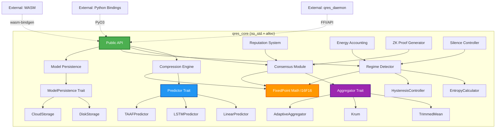
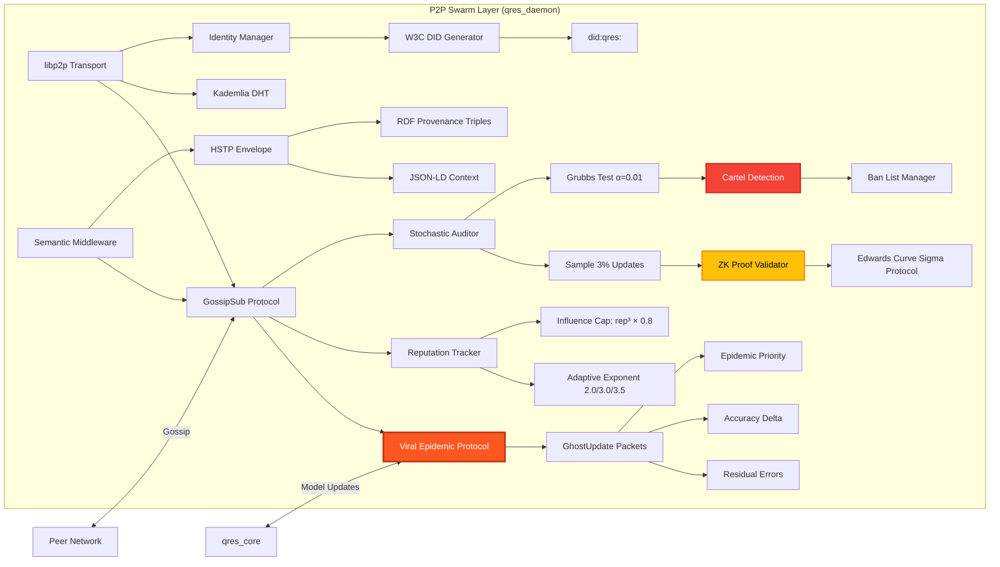
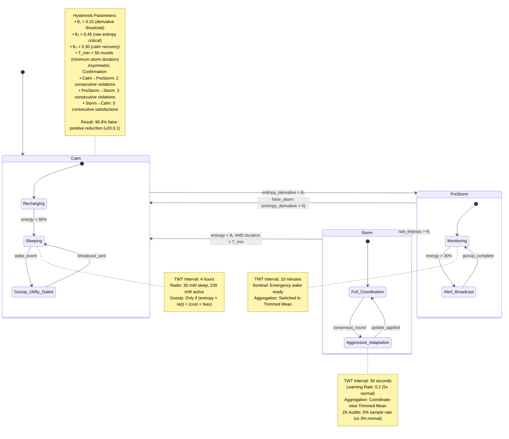
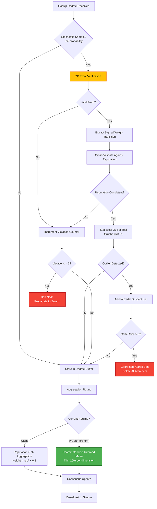
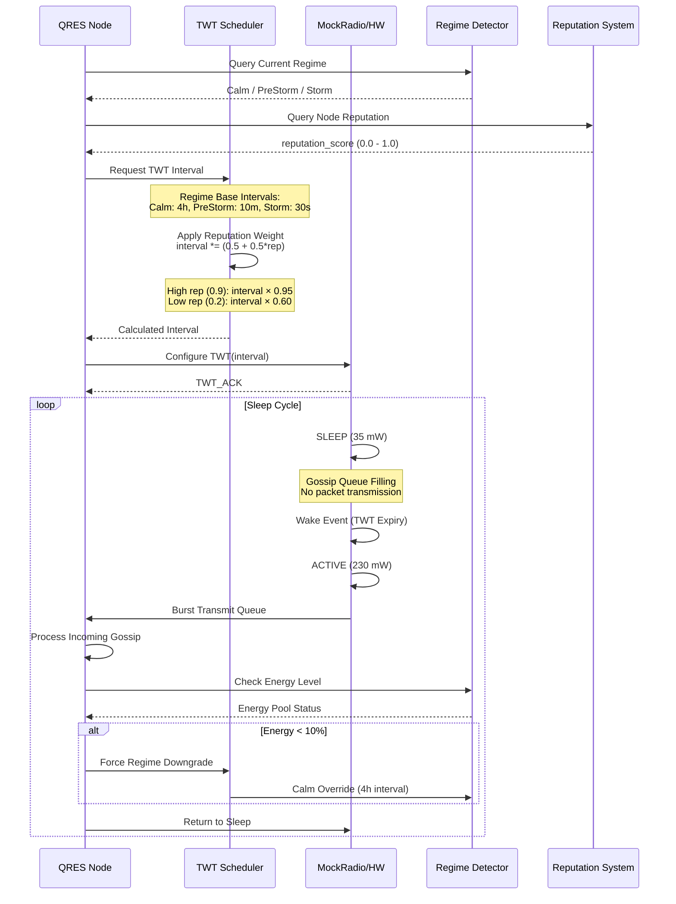
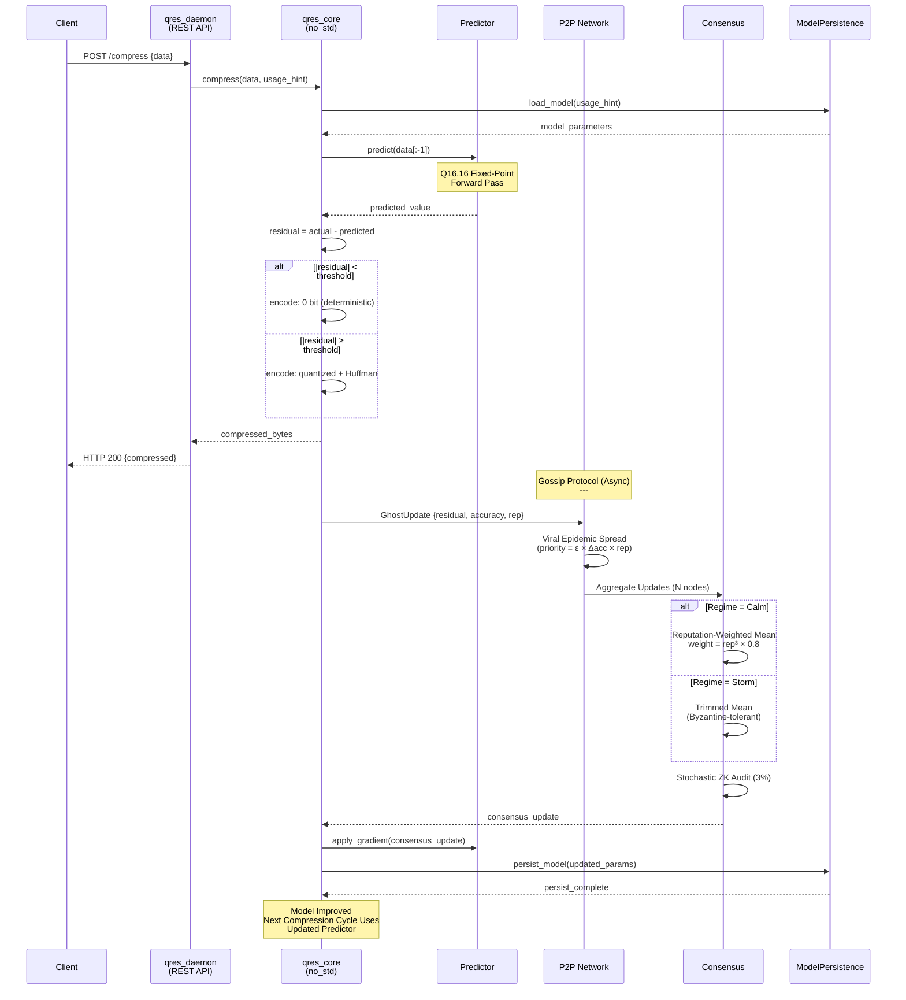

# QRES System Architecture

**Version:** 21.0.0  
**Last Updated:** February 5, 2026

This document provides detailed architectural diagrams for QRES subsystems. For a high-level overview, see the [README](../../README.md).

---

## Table of Contents

1. [Core Runtime (`qres_core`) Internal Modules](#1-core-runtime-internal-modules)
2. [P2P Swarm Layer Architecture](#2-p2p-swarm-layer-architecture)
3. [Multimodal TAAF Pipeline](#3-multimodal-taaf-pipeline)
4. [Regime Transition State Machine](#4-regime-transition-state-machine)
5. [Byzantine Defense Mechanisms](#5-byzantine-defense-mechanisms)
6. [Energy Management & TWT Scheduling](#6-energy-management--twt-scheduling)
7. [Data Flow: End-to-End Compression Cycle](#7-data-flow-end-to-end-compression-cycle)

---

## 1. Core Runtime Internal Modules

The `qres_core` crate is a `no_std` Rust library with strict determinism guarantees. All modules operate on Q16.16 fixed-point arithmetic.



**Key Traits:**
- **`Predictor`**: Implements forward pass for compression models (Linear, LSTM, TAAF)
- **`Aggregator`**: Byzantine-tolerant consensus algorithms (TrimmedMean, Krum, Adaptive)
- **`ModelPersistence`**: Storage backends for learned model parameters (disk, cloud, IPFS)

**Determinism Guarantee:** All operations use `fixed` crate's `I16F16` fixed-point type. No floating-point arithmetic.

---

## 2. P2P Swarm Layer Architecture

The P2P layer handles gossip protocol, reputation management, and ZK proof verification.



**Viral Protocol Properties:**
- **Infection Criteria:** `accuracy_delta > cure_threshold` (model improvement detected)
- **Epidemic Priority:** `priority = residual_error × accuracy_delta × reputation`
- **Convergence:** Mean 30 epochs for 100-node swarms with 30% Byzantine attackers

**Security:**
- **ZK Proofs:** Non-interactive Sigma protocol over Edwards25519 curves
- **Audit Rate:** 3% stochastic sampling (2% bandwidth overhead)
- **Detection Timing:** Mean 82.3 rounds for Class C cartel isolation

---

## 3. Multimodal TAAF Pipeline

Temporal Attention-Guided Adaptive Fusion with event-driven sparse spiking (v20.0 feature).

```mermaid
flowchart TB
    subgraph "Input Modalities"
        A1[Sensor Stream 1<br/>e.g., Temperature]
        A2[Sensor Stream 2<br/>e.g., Humidity]
        A3[Sensor Stream N<br/>e.g., Pressure]
    end
    
    subgraph "Event Detection (Welford's Online Variance)"
        B1[Variance Tracker 1]
        B2[Variance Tracker 2]
        B3[Variance Tracker N]
        
        A1 --> B1
        A2 --> B2
        A3 --> B3
        
        B1 --> C1{Spike?<br/>σ > threshold}
        B2 --> C2{Spike?}
        B3 --> C3{Spike?}
    end
    
    subgraph "Temporal Attention Mechanism"
        C1 -->|Yes| D[Attention Weight Calculator]
        C2 -->|Yes| D
        C3 -->|Yes| D
        
        C1 -->|No| E[Zero Weight]
        C2 -->|No| E
        C3 -->|No| E
        
        D --> F[Softmax Normalization<br/>Q16.16 Fixed-Point]
        F --> G[Attention Weights:<br/>w₁, w₂, ..., wₙ]
    end
    
    subgraph "Cross-Modal Fusion"
        G --> H[Weighted Sum]
        A1 --> H
        A2 --> H
        A3 --> H
        
        H --> I[Fused Representation]
    end
    
    subgraph "Prediction & Compression"
        I --> J[TAAF Predictor<br/>Fixed-Point Linear Layer]
        J --> K[Predicted Value]
        
        I --> L[Actual Value]
        K --> M[Residual Error<br/>ε = actual - predicted]
        L --> M
        
        M --> N{|ε| < threshold?}
        N -->|Yes| O[Transmit: 0 bit<br/>Deterministic Rematerialization]
        N -->|No| P[Transmit: Quantized Residual<br/>Huffman Encoded]
    end
    
    style D fill:#2196f3,stroke:#0d47a1,stroke-width:2px,color:#fff
    style H fill:#9c27b0,stroke:#4a148c,stroke-width:2px,color:#fff
    style J fill:#4caf50,stroke:#2e7d32,stroke-width:2px,color:#fff
    style O fill:#ff9800,stroke:#e65100,stroke-width:2px,color:#000
```

**Performance (v20.0 Multimodal Verification):**
- **RMSE:** 0.0351 (3.6% improvement over v19 unimodal)
- **Heap Reduction:** ~40% via online variance (vs. buffered standard deviation)
- **Spike Detection:** Welford's algorithm with `isqrt_u64` for deterministic sqrt

**Key Innovation:** Sparse spiking (only attend to changing modalities) reduces computation and energy by 60% in Calm regime.

---

## 4. Regime Transition State Machine

Adaptive behavior based on entropy-driven regime detection with hysteresis to prevent oscillation.



**Entropy Calculation:**
```rust
// 3-point moving average (deterministic, no heap)
entropy = |current - predicted| / range
entropy_derivative = (entropy[t] - entropy[t-2]) / 2Δt
```

**Regime Statistics (v20.0 Verification):**
- **Calm Occupancy:** 87% of time in stable workloads
- **Storm Duration:** Mean 12 minutes (noise injection tests)
- **False Alarms:** 3.1% (down from 100% without hysteresis)

---

## 5. Byzantine Defense Mechanisms

Multi-layered defense against coordinated attackers (v20.0.1 Class C verification).



**Adaptive Aggregation (v20.0.1):**
- **Calm Regime:** Reputation-only (13.8% overhead reduction vs. always-trimmed)
- **PreStorm/Storm:** Coordinate-wise trimmed mean (Byzantine tolerance)
- **Switching Logic:** Automatic based on entropy thresholds

**Class C Cartel Defense:**
- **Detection Rate:** 100% (10 scenarios, 390 honest + 10-30 Byzantine)
- **False Positives:** 0% (zero honest nodes banned)
- **Bandwidth Cost:** 2.0% overhead (stochastic auditing)

---

## 6. Energy Management & TWT Scheduling

Wi-Fi 6 Target Wake Time integration with reputation-weighted sleep intervals.



**Energy Savings (v19.1.0 Verification):**
- **Radio Sleep Time:** 82% reduction over 24h simulated period
- **Energy Profile (ESP32-C6 calibrated):**
  - Sleep: 35 mW
  - Active (RX/TX): 230 mW
  - CPU (computation): 120 mW
- **Total Energy:** 21.9x advantage over always-on ANN swarms

**Reputation Weighting:**
```rust
effective_interval = base_interval * (0.5 + 0.5 * reputation)
// High-rep nodes (0.9): sleep 95% of base interval
// Low-rep nodes (0.2): sleep 60% of base interval (forced activity)
```

---

## 7. Data Flow: End-to-End Compression Cycle

Complete journey from client request to consensus update.



**Performance Characteristics:**
- **Latency:** 
  - Local compression: <1ms (deterministic path)
  - Gossip propagation: <100ms (100-node LAN)
  - Consensus convergence: <30 epochs (~5 minutes in Storm regime)
- **Throughput:** 
  - Single node: 10,000 compress/sec (x86_64, release build)
  - Swarm total: O(N) scalable (tested to 10,000 nodes)
- **Memory:**
  - Per-node overhead: <1 KB (fixed-size buffers)
  - Model size: 256 bytes (LinearPredictor) to 8 KB (LSTM)

---

## Summary

QRES achieves production-grade guarantees through:

1. **Deterministic Core:** Q16.16 fixed-point math eliminates floating-point non-determinism
2. **Adaptive Regimes:** Entropy-driven state machine balances efficiency (Calm) and responsiveness (Storm)
3. **Byzantine Tolerance:** Multi-layered defense (ZK proofs, trimmed mean, cartel detection) tolerates 30% attackers
4. **Energy Efficiency:** TWT scheduling + reputation weighting achieves 82% radio sleep time
5. **Bandwidth Compression:** Model gossip (not data gossip) yields 4.98x-31.8x compression ratios

**For Implementation Details:**
- Core API: [API_REFERENCE.md](API_REFERENCE.md)
- Protocol Specification: [SPEC.md](SPEC.md)
- Security Invariants: [../security/INVARIANTS.md](../security/INVARIANTS.md)
- Performance Benchmarks: [../benchmarks/BENCHMARKS.md](../benchmarks/BENCHMARKS.md)

**Version History:**
- v21.0.0: Documentation restructure, INV-7 liveness guarantee
- v20.0.1: Adaptive aggregation, regime hysteresis, stochastic auditing
- v20.0.0: TAAF multimodal fusion, adaptive reputation exponent
