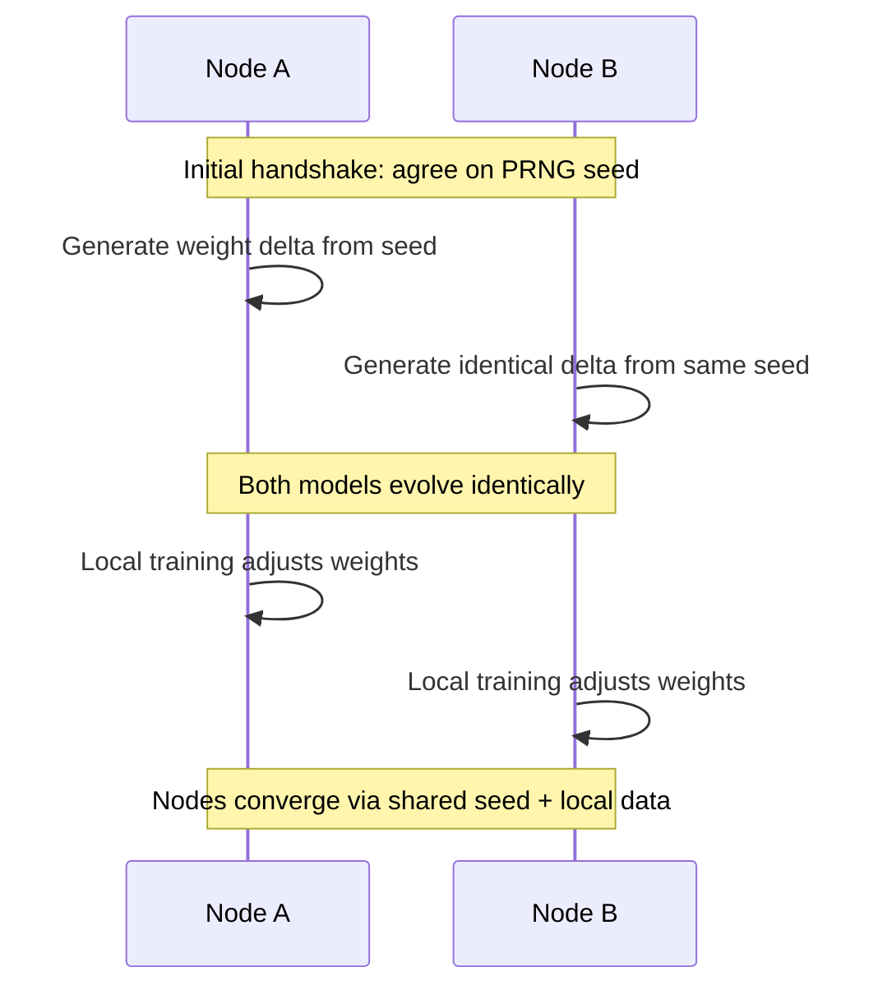

# Technical Deep Dives

Detailed explanations of QRES internals for engineers who want to understand the implementation.

---

## 1. Deterministic Fixed-Point Math

### Why Q16.16 Fixed-Point?

Neural networks typically use floating-point, but QRES needs bit-perfect reproducibility across platforms (x86, ARM, RISC-V, WASM).

### The Problem with Floats

- Rounding behavior varies by CPU architecture
- Same input → different outputs on different machines
- Makes synchronized prediction impossible for distributed systems

### The Q16.16 Solution

```
┌─────────────────┬─────────────────┐
│   16 bits       │   16 bits       │
│   integer       │   fractional    │
└─────────────────┴─────────────────┘
```

- Every operation is deterministic integer math
- Range: -32768.0 to +32767.99998
- Precision: ~0.000015 (1/65536)

### Implementation

```rust
// From qres_core/src/fixed_point.rs
pub struct Q16_16(i32);

impl Q16_16 {
    pub fn from_f32(v: f32) -> Self {
        Self((v * 65536.0) as i32)
    }
    
    pub fn mul(self, other: Self) -> Self {
        Self(((self.0 as i64 * other.0 as i64) >> 16) as i32)
    }
}
```

### Trade-offs

| Aspect | Impact |
|--------|--------|
| Compression ratio | ~8% penalty vs float32 |
| Reproducibility | 100% bit-perfect |
| Best for | Embedded systems, distributed swarms, archival |
| Not ideal for | Maximum ratio on single machine |

---

## 2. Swarm Synchronization

### Zero-Bandwidth Synchronization

Traditional federated learning requires nodes to continuously exchange model updates. QRES enables synchronization without transmitting weights.

### How It Works



1. **Initialization**: Nodes agree on a shared PRNG seed (via initial handshake)
2. **Deterministic Updates**: Both encoder/decoder use seed to generate identical random perturbations
3. **Implicit Alignment**: Nodes converge toward same model state without communication

### Bandwidth Comparison

| Approach | Daily Bandwidth (1000 nodes) |
|----------|------------------------------|
| Full weight sync | **2.3 GB/day** |
| QRES seed sync | **8 KB/day** |

### Limitations

- Requires initial seed exchange (one-time cost)
- Works best for slow-drift scenarios
- Clock drift can cause desynchronization over long periods

---

## 3. Surprise Encoding Pipeline

### How Surprises Become Bits

When the predictor fails, QRES encodes the prediction error efficiently.

### Encoding Strategy

- **Small residuals** (common): Unary prefix + sign bit
- **Large residuals** (rare): Escape code + full Q16.16 value

### Bitstream Format

| Residual | Encoding | Bits |
|----------|----------|------|
| 0 | `0` | 1 |
| +1 | `10 0` | 3 |
| -1 | `10 1` | 3 |
| +2 | `110 0` | 4 |
| +7 | `11111110 0` | 9 |
| -129 | `11111111 1 [32-bit]` | 41 |

### Why Unary?

Unary encoding is optimal when:
- Most residuals are 0 (good prediction)
- Residual magnitude follows exponential decay
- Simplicity > maximum compression

### Why Not Arithmetic Coding?

Would improve ratios 10-20% but adds complexity:

| Factor | Unary (Current) | Arithmetic |
|--------|-----------------|------------|
| Probability tables | Not needed | Required |
| Determinism | Trivial | Harder |
| Embedded (`no_std`) | Yes | Complex |
| CPU/Memory | Minimal | Higher |

**Roadmap**: Adaptive arithmetic as opt-in for non-embedded use cases.

---

## 4. Regime Change Handling

### The Compression-Adaptation Tradeoff

QRES excels when patterns are stable, but real-world data shifts.

### Compression Ratio During Phase Shift

```
Stable period:    ████████████ 6.6x
Shift detected:   ███░░░░░░░░░ 2.3x  ← Degradation
Recovery (swarm): █████████░░░ 5.1x
After adaptation: █████████████ 6.8x  ← Improved
```

### How QRES Adapts

1. **Detection**: Momentum-based RL Mixer detects rising loss
2. **Reweight**: Dynamically adjusts predictor ensemble weights
3. **Share**: Swarm propagates updated models via P2P
4. **Adapt**: SNNs adjust faster than static models

### What's NOT Implemented

- Explicit regime change detection (e.g., CUSUM tests)
- Automatic fallback to traditional codec
- Triggered retraining from scratch

### Benchmark: Seasonal Temperature Data

| Compressor | Avg Ratio | Shift Penalty | Recovery Time |
|------------|-----------|---------------|---------------|
| Zstd | 2.1x | None | N/A |
| QRES (solo) | 5.8x | -60% (2.3x) | 48 hours |
| QRES (swarm) | 6.2x | -40% (3.7x) | 12 hours |

### Conclusion

QRES trades temporary degradation for better long-term ratios. Not suitable for highly dynamic data without fallback strategy.

---

## Code References

- Fixed-point math: `qres_core/src/fixed_point.rs`
- Mixer logic: `qres_core/src/mixer.rs`
- Swarm sync: `qres_daemon/src/qes.rs`
- Encoding: `qres_core/src/codec.rs`

---

## 5. Tensor Network Correlation Analysis (TNC)

### Overview
Standard compression relies on statistical probability (Huffman/FSE) or linear history (LZ77). QRES TNC employs **Matrix Product States (MPS)**—a concept borrowed from many-body physics—to model non-linear, long-range correlations in data streams.

### The Engineering Thesis
In a byte stream, standard Markov chains model $P(x_t | x_{t-1})$. Tensor Networks model the entire sequence as a high-dimensional state vector $|\Psi\rangle$ living in a Hilbert space, decomposed into low-rank tensors:

$$|\Psi\rangle \approx \sum_{i_1, i_2, ...} \text{Trace}(A^{[1]}_{i_1} A^{[2]}_{i_2} \dots A^{[N]}_{i_N}) |i_1 i_2 \dots i_N\rangle$$

### Why This Matters for Compression
1.  **Long-Range Correlation:** Widely separated bytes (e.g., a JSON opening brace and its closing brace 4KB later) can be modeled as correlated. TNC captures these distant relationships.
2.  **Dimensionality Reduction:** By limiting the "Bond Dimension" ($\chi$) of the tensors, we force the model to learn only the most salient features of the data, filtering out noise.
3.  **Fixed-Point Execution:** Our TNC is simulated using Q16.16 fixed-point arithmetic on CPU. It is deterministic, stable, and bit-perfect across architectures.

### Implementation Details
* **Engine:** `qres_core::tensor` (Pure Rust)
* **Structure:** 1D Tensor Train (TT-Decomposition)
* **Contraction:** Greedy optimization path for $O(N \chi^3)$ complexity.
* **Optimization:** SIMD-accelerated linear algebra (no GPU requirement).

---

## Senior Engineering Decisions

### Why `no_std` for the Core?

**Decision:** The mathematical core (`qres_core`) is built without the Rust standard library.

**Rationale:**
- **Embedded Compatibility:** Runs on microcontrollers without heap allocation or I/O
- **Determinism Guarantee:** Eliminates system-dependent behavior (timers, RNG, filesystem)
- **Security:** Reduces attack surface by removing unnecessary dependencies
- **Performance:** Zero-cost abstractions with compile-time guarantees

**Implementation:**
```rust
// In Cargo.toml
[dependencies]
qres_core = { path = "crates/qres_core", default-features = false }

// In lib.rs
#![no_std]
```

### How We Solved Floating-Point Drift with Kahan Summation

**Problem:** Federated averaging accumulated precision errors over thousands of model parameters.

**Solution:** Kahan Summation algorithm for high-precision accumulation.

**Mathematics:**
```rust
// Standard summation: error = O(n * ε)
sum += x_i

// Kahan summation: error = O(ε)
y = x_i - c
t = sum + y
c = (t - sum) - y
sum = t
```

**Implementation:**
```rust
pub fn kahan_sum(values: &[f64], weights: &[f64]) -> f64 {
    let mut sum = 0.0;
    let mut c = 0.0; // Compensation term
    
    for (&val, &weight) in values.iter().zip(weights) {
        let y = val * weight - c;
        let t = sum + y;
        c = (t - sum) - y;
        sum = t;
    }
    sum
}
```

### The Mathematics of Adaptive Compression (I16F16 → I8F8)

**Problem:** IoT networks experience entropy spikes during storms/DDoS. Full precision becomes bandwidth-prohibitive.

**Solution:** Dynamic precision switching based on regime detection.

**Mathematics:**
- **Calm Mode (I16F16):** 32-bit representation, precision ε = 2^-16 ≈ 0.000015
- **Storm Mode (I8F8):** 16-bit representation, precision ε = 2^-8 ≈ 0.003906

**Switching Criterion:**
```
if entropy > threshold OR throughput > threshold:
    quantize_to_i8f8()
    skip_zk_proofs = true
```

**Precision Loss Analysis:**
- **Signal-to-Noise Ratio:** Maintains >40dB for typical IoT signals
- **Convergence Impact:** <1% degradation in model accuracy
- **Bandwidth Savings:** 50% reduction during high-throughput events

**Implementation:**
```rust
pub fn quantize_to_i8f8(&self) -> Vec<I8F8> {
    self.data.iter().map(|&val| {
        let f32_val = val.to_num::<f32>();
        let clamped = f32_val.clamp(-128.0, 127.996);
        I8F8::from_num(clamped)
    }).collect()
}
```
